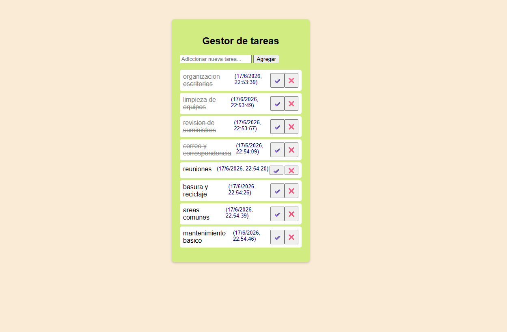

README 
GESTOR DE TAREAS 

Este proyecto en una aplicacion web sencilla para gestionar tareas, desarrollada en html css y javascript 

Este proyecto tiene las siguientes funcionalidades:

Agregar tareas: permite crear nuevas tareas con un título.

Marcar como completadas: las tareas pueden marcarse como realizadas.

Eliminar tareas: opción para borrar tareas que ya no sean necesarias.

Interfaz amigable: diseño simple y fácil de usar para el usuario.

Este proyecto fue desarrollado con fines de aprendizaje y práctica. Durante el proceso, 
utilicé apoyo de herramientas de IA para generar parte del código,
pero me tomé el tiempo de analizarlo cuidadosamente y comprender la función de cada línea.
De esta manera, no solo construí la aplicación, sino que también reforcé mis conocimientos en HTML, CSS y JavaScript, 
entendiendo cómo cada fragmento contribuye al funcionamiento del gestor de tareas.

vista previa 

